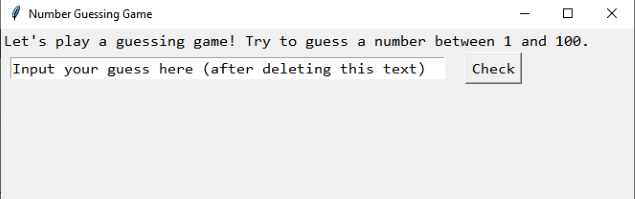
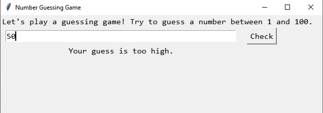
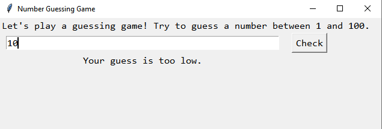
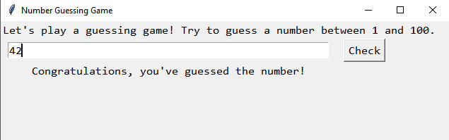

## Description
The number guessing game prompts the user to guess a number between 1 and 100. After inputting their guess and clicking the "Check" button, the program provides feedback on whether the guess is too low, too high, or correct.
## Instructions
1. **Installation :**  
  - Clone the repository using `git clone https://github.com/er-hiba/Number_Guessing_Game.git`.
  - Ensure Python is installed on your system.
2. **Running the Program :**
  - Navigate to the cloned directory.
  - Run the Python script using `python game.py` or your Python interpreter command.
3. **Gameplay :**
  - Input your guess in the provided entry field upon launching the program.
  - Click the "Check" button to evaluate if your guess matches the secret number.
  - Below the entry field, receive feedback on whether your guess is too low, too high, or correct.
  - Keep guessing until you correctly identify the secret number!
## Preview

